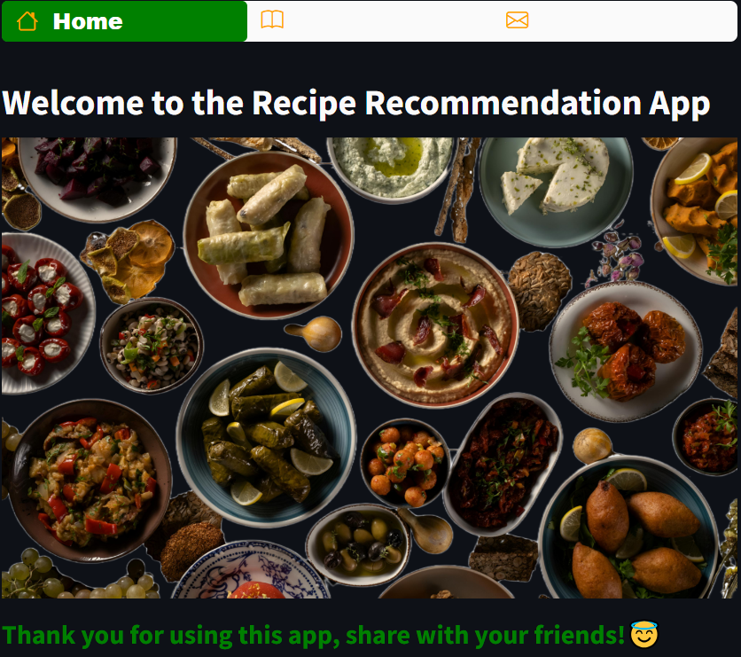
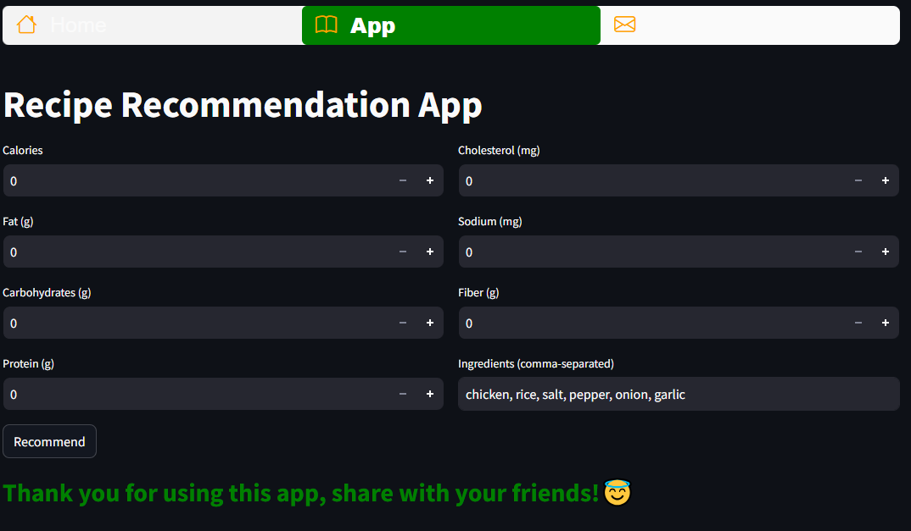
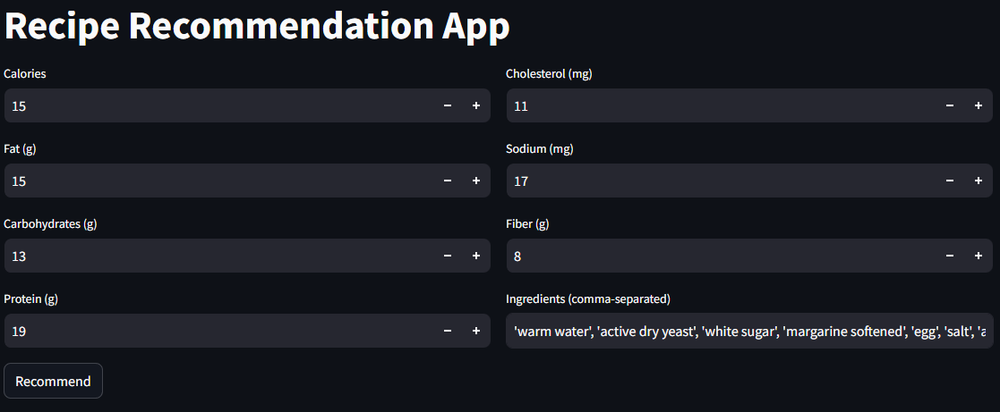
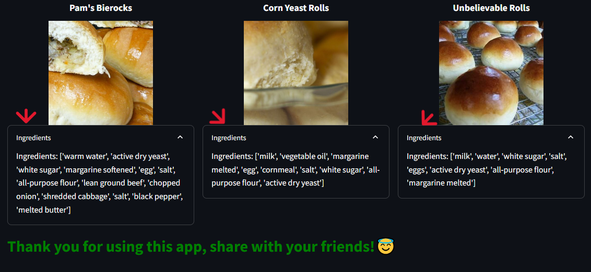
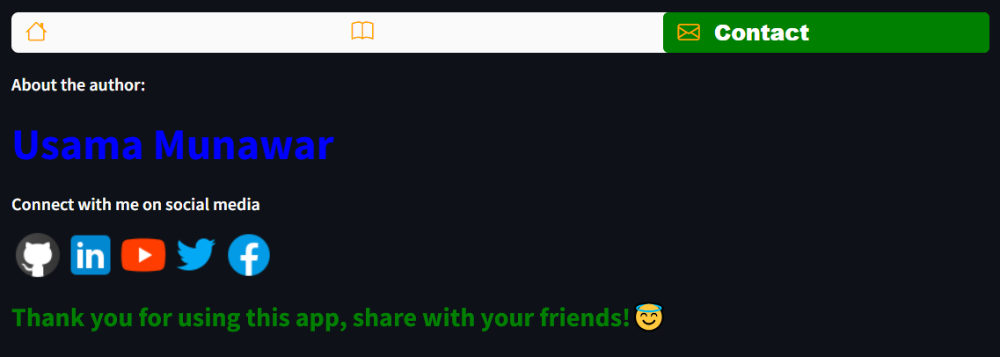

# 🍲 Recipe Recommender Web-App 🍲

Welcome to the **Recipe Recommender Web-App**! 🚀 This application offers personalized recipe suggestions based on your input of nutritional values and ingredients. Using advanced machine learning techniques, this app helps you discover new and exciting recipes tailored to your dietary needs.

## 📊 Dataset Overview  
The dataset used for this project is a CSV file named `recipe_final (1).csv`, containing detailed information on various recipes. Each recipe includes:

- **recipe_id:** Unique identifier  
- **recipe_name:** Recipe name  
- **aver_rate:** Average rating  
- **image_url:** Recipe image  
- **review_nums:** Number of reviews  
- **calories, fat, carbohydrates, protein, cholesterol, sodium, fiber:** Nutritional data  
- **ingredients_list:** List of ingredients  

## 🛠️ Data Preprocessing

1. **Ingredient Processing:**  
   The ingredients are converted to numerical vectors using **TF-IDF**, a technique that evaluates the importance of each ingredient in the dataset.

2. **Numerical Feature Normalization:**  
   Nutritional data (calories, fat, etc.) are scaled using **StandardScaler** to ensure all features are equally weighted.

3. **Feature Combination:**  
   The ingredient vectors and nutritional features are merged, creating a comprehensive feature set representing each recipe.

## 🤖 Machine Learning Model: KNN

The **K-Nearest Neighbors (KNN)** algorithm is applied to find recipes that are most similar based on the combined features. KNN uses **Euclidean distance** to identify the closest matches, making it ideal for personalized recommendations.

---

## 🚀 How to Use the Recipe Recommender App

### 🏠 1. Home  
The "Home" page welcomes you with a brief introduction to the app, complete with visuals. It's your starting point!

  

---

### 📖 2. App: Personalized Recipe Suggestions  

This is where the magic happens! Follow these steps to get personalized recipe recommendations:

1. **Input Nutritional Values & Ingredients:**  
   Enter values like **calories, fat, protein**, and list the ingredients you want to use.
   
   

2. **Click "Recommend":**  
   After entering the data, click "Recommend" to receive customized recipe suggestions powered by machine learning.

3. **Explore Recommendations:**  
   You'll receive a list of recommended recipes, including **recipe names, images,** and **ingredients** for each suggestion.

   .PNG)  
   

---

### 📱 3. Contact  

In the "Contact" section, learn more about the author and connect on social media platforms.

- **About the Author:** Get to know the creator of the Recipe Recommender Web-App.
- **Social Media:** Connect on [GitHub](https://github.com/UsamaMunawarr) | [LinkedIn](https://www.linkedin.com/in/abu--usama) | [YouTube](https://www.youtube.com/@CodeBaseStats) | [Twitter](https://twitter.com/Usama__Munawar) | [Facebook](https://www.facebook.com/profile.php?id=100005320726463)

---

## 👨‍💻 Author: Usama Munawar

- **GitHub:** [@UsamaMunawarr](https://github.com/UsamaMunawarr)  
- **LinkedIn:** [abu--usama](https://www.linkedin.com/in/abu--usama)  
- **YouTube:** [CodeBaseStats](https://www.youtube.com/@CodeBaseStats)  
- **Twitter:** [@Usama__Munawar](https://twitter.com/Usama__Munawar)  
- **Facebook:** [Profile Link](https://www.facebook.com/profile.php?id=100005320726463)

---

## 📜 License: MIT License  
This project is licensed under the **MIT License**. For details, view the [LICENSE](LICENSE) file. 📄

---

